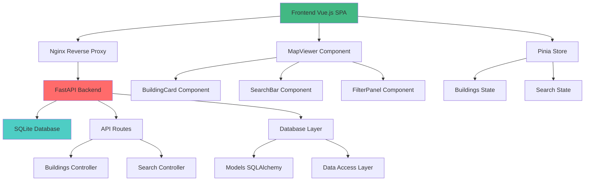
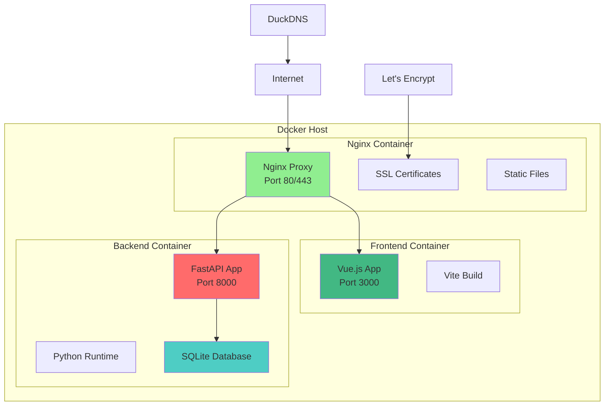
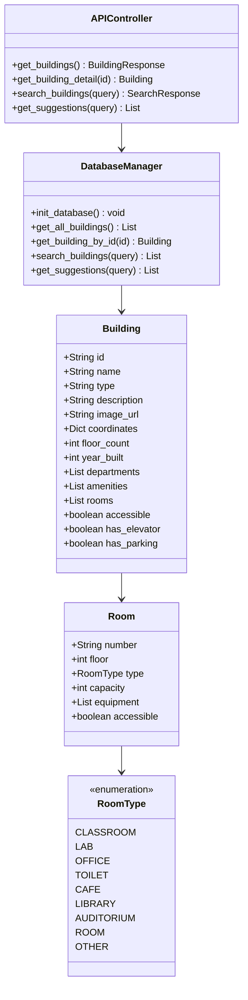
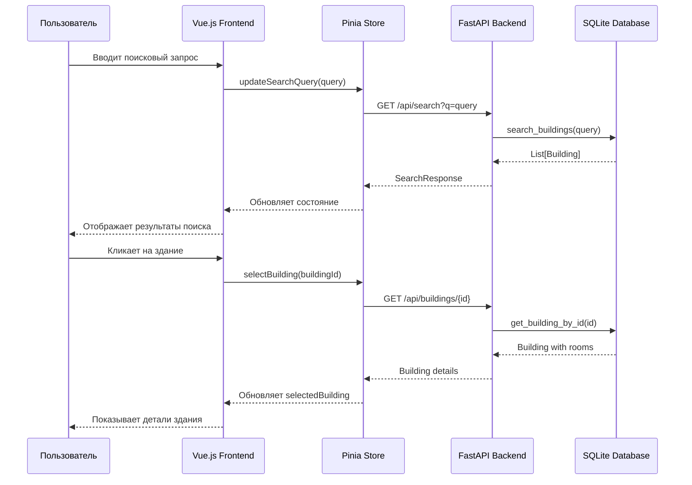
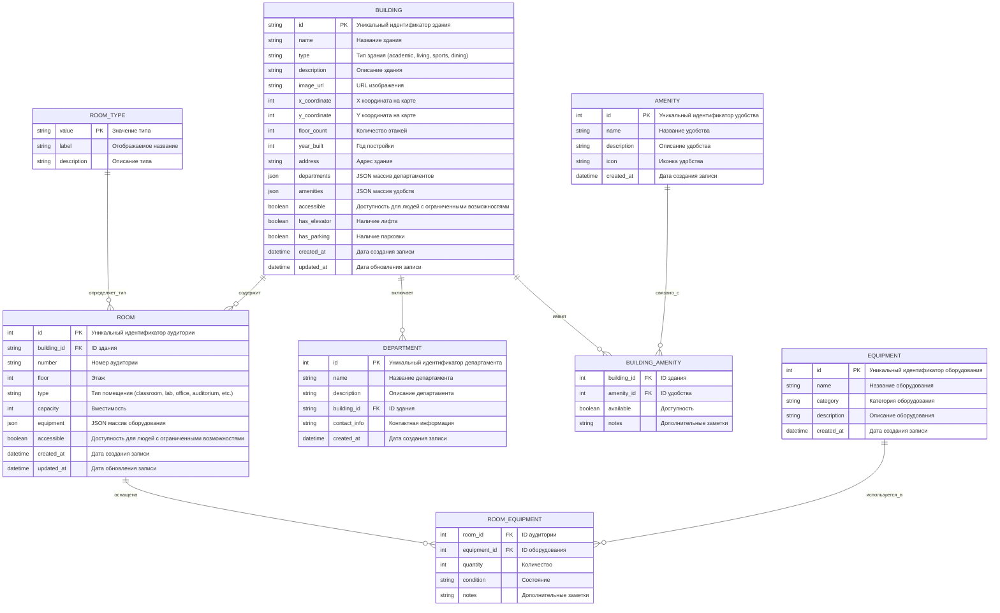

# Интерактивная карта ПГУ

## 📋 Описание проекта

Интерактивная карта **Пензенского государственного университета (ПГУ)** - это современное веб-приложение, которое предоставляет студентам, преподавателям и посетителям удобный способ навигации по территории университета. Проект включает в себя детальную информацию о корпусах, институтах, аудиториях и других объектах инфраструктуры ПГУ.

## 🎯 Основные возможности

- **Интерактивная карта** с масштабированием и панорамированием
- **Поиск зданий** по названию и типу
- **Детальная информация** о каждом корпусе (аудитории, этажи, оборудование)
- **Фильтрация** по типу зданий (учебные, жилые, спортивные, административные)
- **Адаптивный дизайн** для мобильных устройств
- **Быстрый поиск** аудиторий и помещений
- **Информация о доступности** для людей с ограниченными возможностями

## 🏛️ Структура ПГУ в системе

Система содержит информацию о реальных корпусах ПГУ:

### Институты и факультеты:
- **Главный корпус** (ул. Красная, 40) - административные службы
- **Политехнический институт** - IT, вычислительная техника, электроника
- **Медицинский институт** - лечебный факультет, стоматология
- **Педагогический институт им. В.Г. Белинского** - история, филология, педагогика
- **Юридический институт** - правовые дисциплины
- **Институт экономики и управления** - экономика, менеджмент
- **Институт физической культуры и спорта** - спортивные дисциплины

### Инфраструктура:
- **Научно-техническая библиотека** - читальные залы и электронные ресурсы
- **Столовая** - питание для студентов и сотрудников
- **Общежития** - проживание для иногородних студентов
- **Военный учебный центр им. В.Ф. Шишкова** - военная подготовка

## 🛠️ Технологический стек

### Frontend
- **Vue.js 3** - прогрессивный JavaScript-фреймворк
- **Vue Router** - маршрутизация в SPA
- **Pinia** - управление состоянием приложения
- **Vite** - быстрый сборщик для разработки
- **Tailwind CSS** - utility-first CSS фреймворк
- **Vite PWA** - поддержка Progressive Web App

### Backend
- **FastAPI** - современный Python веб-фреймворк
- **SQLite** - легковесная реляционная база данных
- **SQLAlchemy** - ORM для работы с базой данных
- **Pydantic** - валидация данных и сериализация
- **Uvicorn** - ASGI сервер для продакшена

### DevOps и деплой
- **Docker** - контейнеризация приложения
- **Docker Compose** - оркестрация многоконтейнерного приложения
- **Nginx** - веб-сервер и reverse proxy
- **Let's Encrypt** - SSL сертификаты
- **DuckDNS** - динамический DNS

## 📁 Структура проекта

```
map_v2/
├── front/                      # Frontend приложение (Vue.js)
│   ├── public/                 # Статические файлы
│   │   ├── components/         # Vue компоненты
│   │   │   ├── MapViewer.vue   # Основной компонент карты
│   │   │   ├── BuildingCard.vue # Карточка здания
│   │   │   ├── SearchBar.vue   # Поиск
│   │   │   └── FilterPanel.vue # Фильтры
│   │   ├── stores/             # Pinia stores
│   │   │   └── buildings.ts    # Состояние зданий
│   │   ├── router/             # Vue Router
│   │   └── main.js             # Точка входа
│   ├── package.json            # Зависимости frontend
│   └── vite.config.ts          # Конфигурация Vite
│
├── backend/                    # Backend приложение (FastAPI)
│   ├── main.py                 # Точка входа FastAPI
│   ├── models.py               # SQLAlchemy модели
│   ├── database.py             # Подключение к БД
│   ├── pgu_real_data.py        # Данные ПГУ
│   └── requirements.txt        # Python зависимости
│
├── nginx/                      # Конфигурация Nginx
│   └── conf.d/
│       └── unl-map.conf        # Конфигурация домена
│
├── docker-compose.yml          # Docker Compose конфигурация
├── Dockerfile.backend          # Dockerfile для backend
├── Dockerfile.frontend         # Dockerfile для frontend
└── README.md                   # Документация проекта
```

## 🏗️ Архитектура системы

### Архитектурный паттерн: Трехуровневая архитектура

```
┌─────────────────┐     ┌─────────────────┐     ┌─────────────────┐
│   Presentation  │────▶│    Business     │────▶│   Data Access   │
│     Layer       │     │     Layer       │     │     Layer       │
│   (Vue.js)      │     │   (FastAPI)     │     │   (SQLite)      │
└─────────────────┘     └─────────────────┘     └─────────────────┘
```

### Диаграмма компонентов:



### Диаграмма развертывания:



### Уровни архитектуры:

1. **Presentation Layer (Уровень представления)**
   - Vue.js SPA приложение
   - Интерактивная карта SVG
   - Компоненты пользовательского интерфейса
   - Маршрутизация и навигация

2. **Business Layer (Бизнес-логика)**
   - FastAPI REST API
   - Валидация данных через Pydantic
   - Бизнес-правила и обработка запросов
   - Сериализация/десериализация данных

3. **Data Access Layer (Уровень доступа к данным)**
   - SQLite база данных
   - SQLAlchemy ORM
   - Модели данных зданий и аудиторий

## 🗃️ Модель данных

### Диаграмма классов:



### Диаграмма последовательности (поиск зданий):



### Основные сущности:

- **Building** - Здание/корпус университета
- **Room** - Аудитория/помещение
- **RoomType** - Тип помещения (enum)

### Атрибуты зданий:
- Базовая информация (название, описание, тип)
- Координаты на карте
- Физические характеристики (этажи, год постройки)
- Департаменты и удобства
- Доступность для людей с ограниченными возможностями

### Атрибуты аудиторий:
- Номер и этаж
- Тип помещения
- Вместимость
- Оборудование
- Доступность

## 🚀 Развертывание

### Разработка (локально)

1. **Клонирование репозитория:**
```bash
git clone https://github.com/your-repo/map_v2.git
cd map_v2
```

2. **Backend:**
```bash
cd backend
pip install -r requirements.txt
python main.py
```

3. **Frontend:**
```bash
cd front
npm install
npm run dev
```

### Продакшен (Docker)

1. **Сборка и запуск:**
```bash
docker-compose up -d
```

2. **SSL сертификаты:**
```bash
./deploy-ssl-fix.sh
```

## 🔧 API Endpoints

### Buildings
- `GET /api/buildings` - Получить все здания
- `GET /api/buildings/{id}` - Получить здание по ID
- `GET /api/search?q={query}` - Поиск зданий
- `GET /api/suggestions?q={query}` - Автодополнение поиска

### Примеры запросов:

```bash
# Получить все здания
curl http://localhost:8000/api/buildings

# Поиск зданий
curl http://localhost:8000/api/search?q=Политехнический

# Получить конкретное здание
curl http://localhost:8000/api/buildings/1
```

## 📊 Производительность

### Оптимизации:
- **Кэширование** SVG карт в памяти
- **Lazy loading** компонентов Vue
- **Компрессия** статических файлов через Nginx
- **Bundle splitting** для оптимизации загрузки
- **PWA** поддержка для оффлайн использования

### Масштабируемость:
- Контейнеризация через Docker
- Горизонтальное масштабирование через Docker Compose
- Reverse proxy через Nginx
- Кэширование на уровне HTTP

## 🔒 Безопасность

- **HTTPS** через Let's Encrypt
- **CORS** настройки для API
- **Rate limiting** для защиты от DDoS
- **Валидация** входных данных через Pydantic
- **Изоляция** через Docker containers

## 📱 Мобильная адаптация

- **Responsive design** через Tailwind CSS
- **Touch events** для мобильной навигации
- **PWA** для установки на мобильные устройства
- **Оптимизированные** изображения и ресурсы

## 🧪 Тестирование

### Фронтенд:
- **Unit tests** для Vue компонентов
- **Integration tests** для API взаимодействия
- **E2E tests** для пользовательских сценариев

### Бэкенд:
- **Unit tests** для бизнес-логики
- **API tests** для endpoints
- **Database tests** для ORM операций


## 👥 Команда разработки

- **Frontend Developer** - Vue.js, JavaScript, CSS
- **Backend Developer** - Python, FastAPI, SQLite
- **DevOps Engineer** - Docker, Nginx, SSL


##### ER диаграмма базы данных:


## 📞 Контакты

- **Сайт:** [unl-map.duckdns.org](https://unl-map.duckdns.org)

